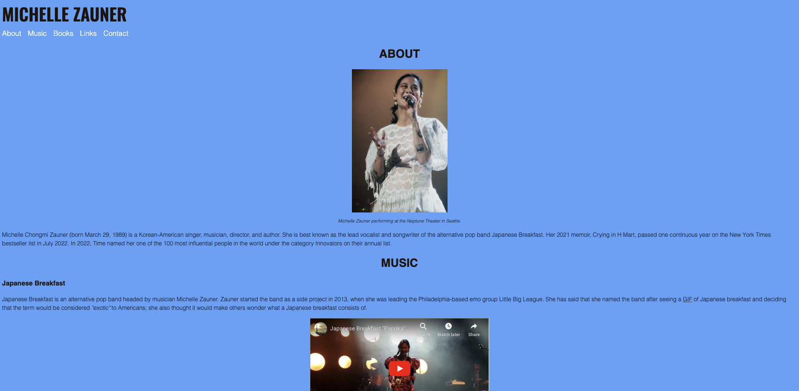
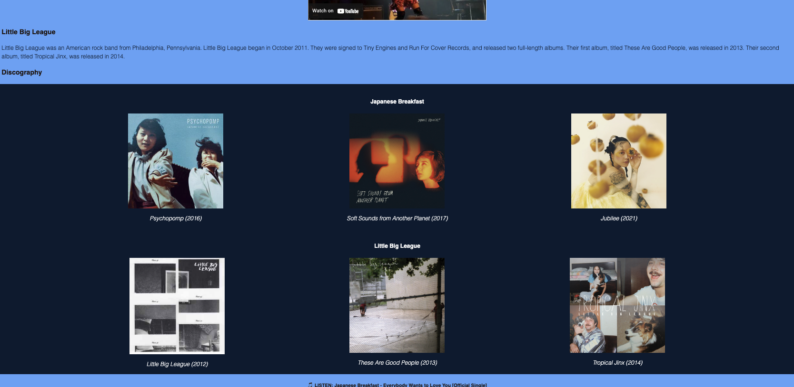
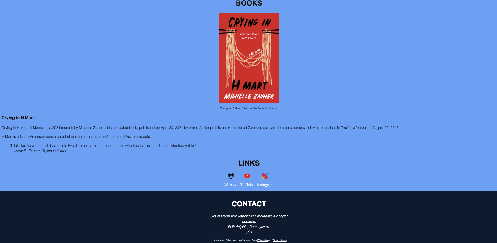

# Redesigning a Previous Project

## Overview
Welcome to my project repository where I'll be documenting the process of redesigning a project I originally completed in Fall 2022 in my first semester of ACS 1700. The assignment requires us to redesign a previous project using CSS concepts and ideas we've learned in class. For my redesign, I chose to work on a showcase about one of my favorite artists, Michelle Zauner.

## Intro
Before diving into the details of my redesign, it's crucial to take a step back and understand the initial project's state. To achieve this, I captured screenshots of the original project in its original form. You can find these screenshots in the "Screenshots" directory of this repository. These 'before' images will help provide context and demonstrate the transformation achieved through the redesign process.

## Project Requirements
Here's a brief overview of the main challenges and goals I set out to achieve:

### 1. Typography Update
I aimed to update the typography and focused on setting appropriate line-height and base font size to enhance readability and aesthetics.

### 2. Graphics, Images, and Backgrounds
I integrated background images to create a visually appealing atmosphere and used icon images to enhance buttons and other UI elements. This added a more dynamic and interactive feel to the showcase and contributed to a more polished and cohesive design.

### 4. Layout Enhancement
I worked on improving the layout by implementing flexbox and grid where applicable. 

